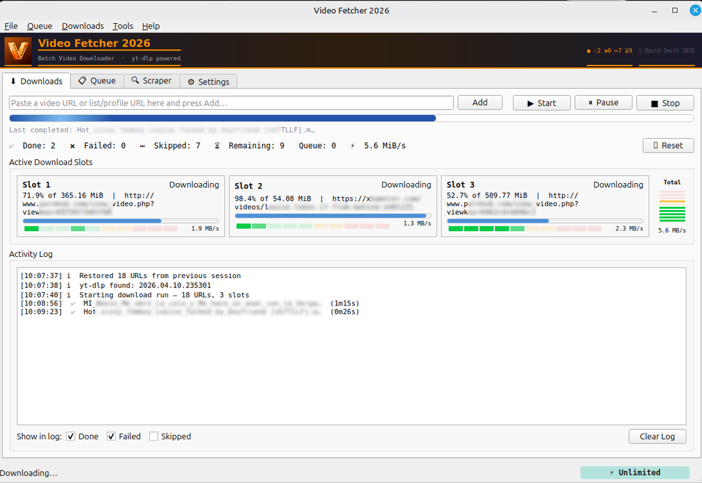
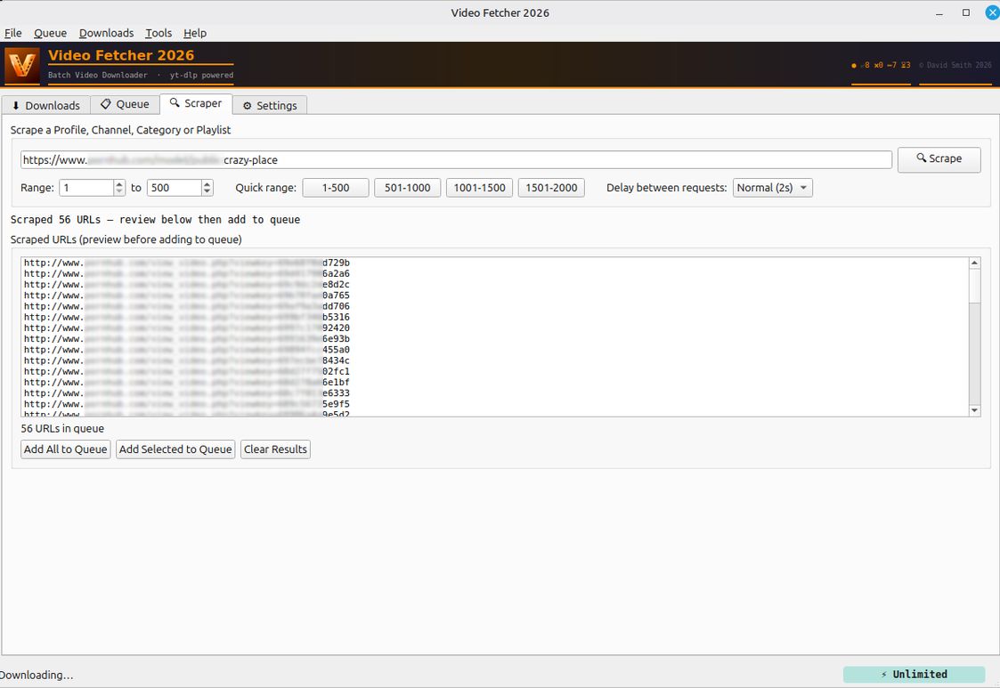
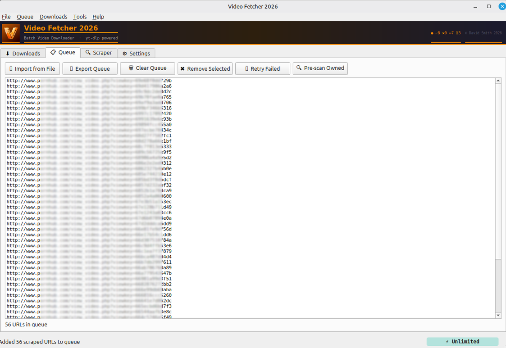
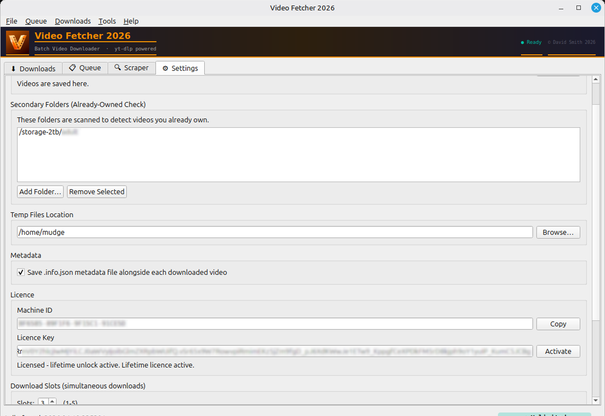

<p align="center">
  
</p>

<h1 align="center">Video Fetcher 2026</h1>

<p align="center">
  <strong>Batch video downloader for Linux &amp; Windows</strong><br>
  Powered by yt-dlp · Built with Python &amp; PyQt6
</p>

<p align="center">
  <a href="https://maxprovider.net/downloads.html">⬇️ Download</a> ·
  <a href="https://maxprovider.net/purchase.html">🔑 Purchase License</a> ·
  <a href="https://maxprovider.net/howto.html">📖 Documentation</a> ·
  <a href="https://maxprovider.net">🌐 Website</a>
</p>

---

## What Is Video Fetcher 2026?

Video Fetcher 2026 is a desktop GUI application that makes batch downloading videos simple. Instead of running yt-dlp from the command line, Video Fetcher gives you a clean graphical interface with parallel downloads, queue management, channel scraping, and live progress monitoring.

Built for people who want the power of yt-dlp without the terminal.

<p align="center">
  
</p>

---

## Features

### Downloading
- **1 to 5 parallel download slots** — each with its own progress bar and VU speed meter
- **Live speed display** — per-slot and total download speed
- **Smooth overall progress bar** — tracks the entire batch, not just individual files
- **Pause and resume** — freeze downloads mid-file on Linux, or pause between files on Windows
- **Stop with options** — stop immediately or finish current downloads and save the rest
- **Queue persistence** — close the app, reopen it, your queue is still there
- **Automatic .info.json metadata** — optionally save metadata alongside each video

### Scraping
- **Channel/profile scraper** — paste a channel URL, extract all video links automatically
- **Quick range buttons** — scrape in batches of 500 (1-500, 501-1000, etc.)
- **Duplicate detection** — never downloads the same video twice

### Smart Features
- **Already-owned detection** — scans your library before downloading to skip files you already have
- **Pre-scan queue** — check your entire queue against local folders before starting
- **Failed URL logging** — automatically saves failed URLs for easy retry
- **Speed limiter** — dropdown in the status bar to cap download speed (unlimited down to 100 KB/s)
- **Right-click activity log** — copy lines, open downloaded files, or delete files directly

### Cross-Platform
- **Single source code** — one Python file that runs on both Linux and Windows
- **Linux:** System yt-dlp and ffmpeg from PATH
- **Windows:** yt-dlp and ffmpeg bundled inside the executable — zero dependencies

<p align="center">
  
</p>

---

## Screenshots

<p align="center">
  
  
</p>
<p align="center">
  
  
</p>

---

## Download

| Platform | Download | Notes |
|----------|----------|-------|
| 🐧 **Linux x86_64** | [Download](https://maxprovider.net/files/VideoFetcher2026) | Requires yt-dlp and ffmpeg installed (`sudo apt install yt-dlp ffmpeg`) |
| 🪟 **Windows x64** | [Download](https://maxprovider.net/files/VideoFetcher2026.exe) | yt-dlp and ffmpeg bundled — no extra installs needed |

Both are standalone executables — no installation required. Download, run, done.

---

## Free vs Licensed

Video Fetcher 2026 is free to download and use. A one-time lifetime licence unlocks all features.

| Feature | Free | Licensed |
|---------|:----:|:--------:|
| Download videos | ✅ | ✅ |
| Activity log with right-click options | ✅ | ✅ |
| Queue persistence | ✅ | ✅ |
| Download slots | 1 | **Up to 5** |
| Download speed | 2 MB/s max | **Unlimited** |
| Scraper range | 10 URLs | **Unlimited** |
| Queue size | 10 URLs | **Unlimited** |
| Quick range buttons | ❌ | ✅ |
| Price | Free | **£12.99 one-time** |

👉 **[Purchase a lifetime licence](https://maxprovider.net/purchase.html)** — one-time payment, no subscriptions, no recurring fees.

---

## How It Works

1. **Add URLs** — paste video URLs into the queue, or use the scraper to extract them from a channel page
2. **Click Start** — Video Fetcher downloads them in parallel across your configured slots
3. **Monitor progress** — watch the VU meters, speed display, and progress bars
4. **Done** — videos saved to your chosen folder with optional .info.json metadata

### Already-Owned Detection

Video Fetcher checks your existing library before downloading. If a video ID is found in any filename (in `[brackets]`), it's skipped automatically. No duplicate downloads, ever.

### Speed Limiter

Click the speed indicator in the status bar to select a speed limit — from unlimited down to 100 KB/s. Colour-coded from green (fast) to red (slow). Takes effect on the next download.

---

## Companion Apps

### MetaFetch (Free)

Scans your existing video library and fetches missing `.info.json` metadata files using yt-dlp. Perfect for videos downloaded before you enabled metadata saving.

👉 **[Download MetaFetch](https://maxprovider.net/metafetch.html)**

### Stash Info JSON Importer Plugin (Free)

Imports `.info.json` metadata into [Stash](https://stashapp.cc/) media manager — automatically populates title, date, description, tags, and studio for each scene.

👉 **[Download Plugin](https://maxprovider.net/plugins.html)**

---

## System Requirements

### Linux
- x86_64 architecture
- yt-dlp installed (`sudo apt install yt-dlp`)
- ffmpeg installed (`sudo apt install ffmpeg`)
- No other dependencies — standalone executable

### Windows
- Windows 10 or later (64-bit)
- No dependencies — yt-dlp and ffmpeg are bundled inside the executable

---

## Installation

There is no installation. Download the executable and run it.

### Linux

```bash
# Download
wget https://maxprovider.net/files/VideoFetcher2026

# Make executable
chmod +x VideoFetcher2026

# Run
./VideoFetcher2026
```

### Windows

Download `VideoFetcher2026.exe` and double-click to run. No installation wizard, no admin rights needed.

---

## FAQ

**Is this open source?**
No. Video Fetcher 2026 is shareware — free to download and use with limits, with an optional paid licence to unlock all features.

**Does it work with [site name]?**
Video Fetcher uses yt-dlp as its download engine, which supports hundreds of sites. If yt-dlp supports it, Video Fetcher can download from it.

**Is my licence a subscription?**
No. One-time payment, lifetime licence. No renewals, no expiration.

**Can I use my licence on multiple computers?**
Each licence is tied to one machine. Contact us for additional keys.

**What if yt-dlp stops working after a site update?**
Update yt-dlp. On Linux: `sudo yt-dlp -U`. On Windows: use Tools → Update yt-dlp inside the app.

**Is my payment secure?**
All payments are processed by [Stripe](https://stripe.com), one of the world's largest payment processors. We never see or store card details.

---

## Tech Stack

- **Language:** Python 3 / PyQt6
- **Download Engine:** yt-dlp
- **Video Processing:** ffmpeg
- **Compiler:** Nuitka (compiled to native C)
- **Licensing:** Ed25519 public-key signatures
- **Platforms:** Linux x86_64, Windows x64

---

## Links

- 🌐 **Website:** [maxprovider.net](https://maxprovider.net)
- ⬇️ **Downloads:** [maxprovider.net/downloads](https://maxprovider.net/downloads.html)
- 🔑 **Purchase:** [maxprovider.net/purchase](https://maxprovider.net/purchase.html)
- 📖 **Documentation:** [maxprovider.net/howto](https://maxprovider.net/howto.html)
- ☕ **Support Development:** [maxprovider.net/support](https://maxprovider.net/support.html)
- 📧 **Contact:** [david@maxprovider.net](mailto:david@maxprovider.net)

---

## Changelog

### v1.0.0 — April 2026
- Initial release
- 1-5 parallel download slots with VU meters
- Channel/profile scraper with quick range buttons
- Already-owned detection (Layer 1 + Layer 2)
- Queue persistence and restore
- Speed limiter dropdown (status bar)
- Right-click activity log (copy, open, delete)
- Cross-platform: Linux x86_64 and Windows x64
- Ed25519 licence key system
- Nuitka-compiled native executables

---

<p align="center">
  <strong>Video Fetcher 2026</strong><br>
  © 2026 David Smith · <a href="https://maxprovider.net">maxprovider.net</a><br>
  <a href="mailto:david@maxprovider.net">david@maxprovider.net</a>
</p>
